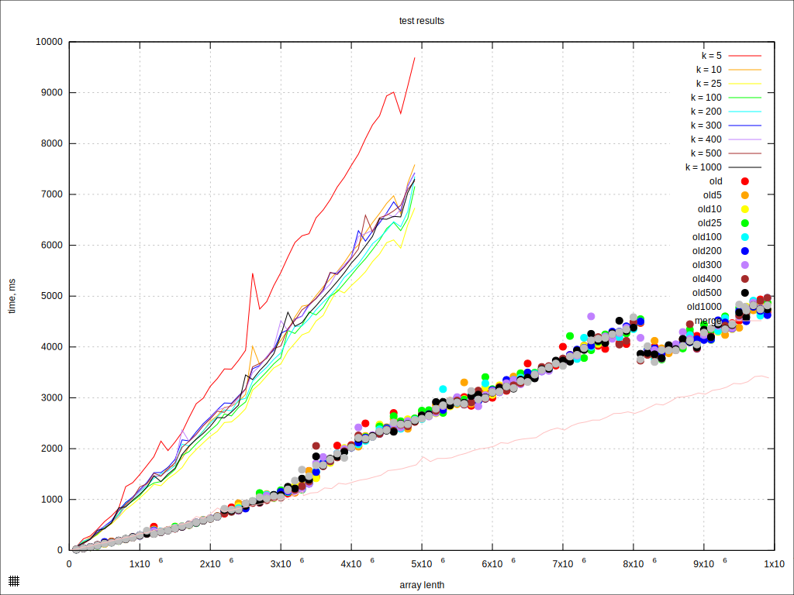

# Практика 4 - Cравнение куч

## Вывод

Мы протестировали различные алгоритмы сортировок на кучах на широком спектре случайно сгенерированных данных.  
На основе получаенных результатов, можно сделать следующие выводы:

## Сортировка k-ичной кучей

    k почти не влиеят. это видно по графиуку.

## "Улучшенная" сортировка k-ичной кучей

    k влияет, но не понятно как. Лучший результат получился при k = 25, худший - при k = 5.  
    в целом эта сортировка работает в несколько раз медленнее обычной версии, хотя, казалось бы, в оценке асимптотики k заменяется на logk.  
    видимо, на сборку-разборку всех доп. куч тратится очень много времени,  
    вследствие чего Бабичева Куча оказывается неприменимой на практике.

# Графики

    для Бабичевых Куч тесты были завершены на размере в полмиллиона, вследствие того, что "долго капец"  
    сортировки, конечно, прикольные, но из графика видно, что самые удачные экземпляры по времени в несколько раз уступают  
    сортировке слиянием, которая, напомню, оказалась самой медленной из логарифмических сортировок.  
    также не могу не отметить сложность Бабичевой Кучи, на написание которой ушло очень много времени и которая в моей реализации вышла крайне неэффективной.  
    Неудевительно...

*“It took me a lifetime.”*  
― Sergei Babichev

